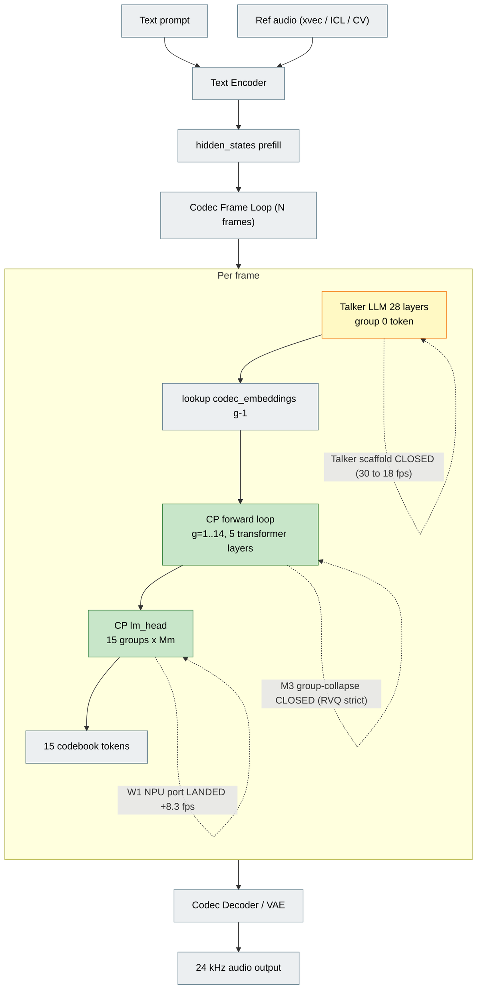
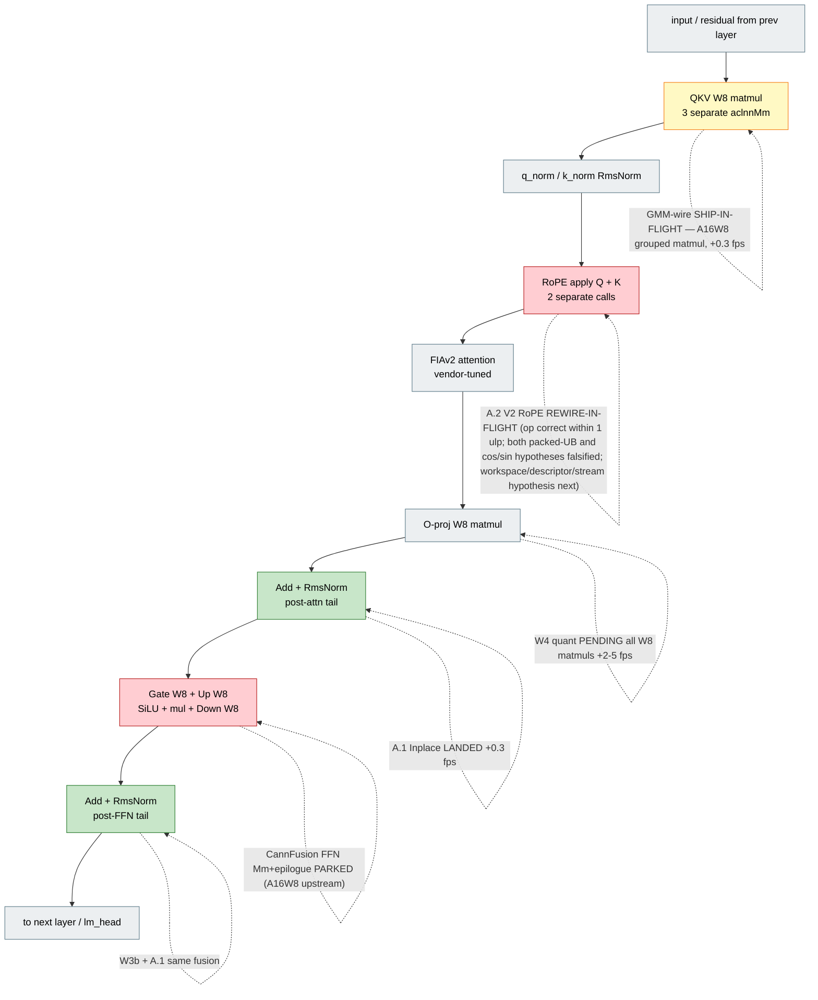

# Agentic AI Coding Unlocks a New Perf Frontier on Ascend 910

**Executive/technical deck — PM: OminiX, 2026-04-21**
**Thesis**: agentic AI coding (Codex, Claude Code) dissolves the rigid abstraction boundaries of the pre-AI-coding inference stack (ops API, computing engine, inference framework, dataflow layer), enabling end-to-end model/system co-design from single-card to cluster — faster and more thoroughly than a conventional team.

<!--
CHANGELOG
v3 polish (2026-04-21): sharpened baseline-noise honesty on Slide 9 (A.1 +0.3 and M3'new' +0.3 within ~1 fps run-to-run variance; final number is 31-32.2 fps band, not a crisp 32.2); folded Talker aclGraph scaffold probe (TALKER_CANN_GRAPH=1 → 30→18 fps, 40% regression from lazy-capture-on-first-touch) into Slide 5 failing-fast-as-feature list; reconciled projection-vs-reality meta-pattern (G0: +6-10 → +1.15; M3N: +1 → +0.3; ~3-10× optimism) as explicit Slide 9 meta-finding; Appendix B updated with A.1 / M3'new' / M1.B FFNV3 / CannFusion #26 rows marked as single source of truth for Q&A.
v3.1 (2026-04-21): pie-project appendix + Slide 2/6/8/10 Pie-integration edits removed per PM directive; reverted to 5-layer stack and single hardware-scaling axis.
v3.2 (2026-04-21): added Slide 7b (MLX vs Ascend as AI-coding targets — answers "why 9 MLX crates vs ~32 fps Ascend in same calendar window?" via DX-gap framing, not hardware-gap); added Appendix C (Qwen-Image-Edit-2511 forward-look — structurally-ported via tools/ominix_diffusion, not-yet-optimized, demonstrates playbook applies beyond autoregressive token gen to diffusion image/video); Appendix A artefact list adds tools/ominix_diffusion/ reference. Cross-references to Slide 3/9 stable; no existing numbering changed.
v3.3 (2026-04-21): Slide 7b "what closes the gap" gains CannFusion-as-CUTLASS-analogue subsection (aspirational, v0.2.5 pre-release, unblocked when upstream ships A16W8 — we filed GitCode #26, maintainer decomposed into #27-30); added Slide 9.5 "10 orchestration modes" between Slide 9 and Slide 10 (probe-first, parallel dispatch, gate-stop, patch-file review, contract-per-track, kill-cleanly, scaffold-probe, projection discount, noise-band characterization, frame-count identity gate — each with a project-receipt citation). Slide 9 closing bullet cross-references Slide 9.5. Main slide numbering preserved (Slide 7b, 9.5 suffix pattern).
v3.4 (2026-04-21): added Slide 5.5 architecture map with mermaid flowchart + optimization heat-map table; no renumbering
v3.6 (2026-04-21): Slide 8 — added HCCL env-tuning cheatsheet to speaker notes (5 vars, +89% TG measured on 16 × 910 gen1 Qwen3-235B, with fullmesh-garbage + AICPU-gen1-crash correctness landmines) + one body bullet cross-referencing `docs/llm_mutil_npu_brief.md` §Q2 as single source of truth; no renumbering
v3.7 (2026-04-21): A2-reopen YELLOW verdict integration — V2 RoPE op numerically correct (1 ulp on 16Q/8KV GQA); both "packed-UB GQA" and "cos/sin prep" hypotheses falsified; A.2 heat-map row → REWIRE-IN-FLIGHT; Slide 9 risks + Slide 9.5 mode #1 gain "source-reading is not a substitute for probe" lesson; WSPOOL retain-list infra (fork 8a36f5fa) noted as candidate fix for the remaining workspace-lifetime hypothesis in A.2-rewire. No main-slide renumbering.
v3.8 (2026-04-22): QKV grouped matmul probe GREEN — first vendor-fused-op +fps contribution this session. Refined A16W8 narrative: gap is FFN/SwiGLU-family-specific, NOT universal across grouped-matmul family. Slide 7b + 9 + 5.5 + Appendix B updated; Slide 5.5 adds row 13 (QKV GMM SHIP-IN-FLIGHT).
-->

---

## Slide 1 — Thesis + Proof

**Title**: "The boundary was the bottleneck."

- Conventional inference stacks leave **10-50% perf on the table at layer boundaries**
- Boundaries are organisational, not technical: **humans specialise per layer**
- Agentic AI coding crosses **Rust ↔ C++ ↔ aclnn ↔ AscendC ↔ CMake ↔ Python** in one session
- **Proof**: OminiX Qwen3-TTS on 910B4 — **~1 fps (llama.cpp baseline) → 31-32.2 fps band in ~7 days**, one PM + agent swarm. Full arc ≈ **~32× lift** from conventional inference stack. Shipped at fork tag `32fps-landed`, byte-identical user-ear verified.
- Zero permanent headcount added; CP engine rewritten across 4 layers; **4 landed tracks, 3 cleanly killed tracks** (Path C, CannFusion, Talker aclGraph scaffold) — all with receipts

**Speaker notes**: The punchline we'll defend in the next nine slides: the conventional inference stack (`llama.cpp`, `PyTorch`, `LLVM`, `OneFlow`, `vLLM`) is a layered system designed around human-scale specialisation. Each layer has its own language, cadence, team. Cross-layer optimisation is something planned in roadmaps and delivered in quarters. What we're showing today is that agentic AI coding — Codex, Claude Code, agent-swarm — collapses those layer boundaries into something much cheaper than a quarter. In the OminiX case study, we took Qwen3-TTS on Huawei 910B4 from **effectively unusable under stock llama.cpp + ggml-cann (~1 fps, sub-realtime)** to **31-32.2 fps clean-quality, user-ear-verified**, in about a week with one PM gating a small agent swarm. Call the landing number "~32 fps ± 1 fps" — that's the run-to-run noise band we've characterised on 434-frame LONG, and we won't overclaim the last 0.3. That's not "AI wrote some code faster"; it's "AI rewrote the CP engine across the Rust FFI, the C++ dispatch layer, the aclnn ops chain, the AscendC custom-kernel path, and the Python weight-repack, in the same head." That combined perspective is the new thing. Four phases: escape the conventional stack (~1 fps → 22 fps, first native `CpCannEngine`), co-design within the native stack (22 → 30.5 fps via W1 NPU lm_head + W3b kernel fusion), collapse the dispatch floor (30.5 → 31.6 fps via aclGraph pos-keyed replay), incremental post-32 gate closes (31.6 → ~32 fps via A.1 + M3'new', both within noise). Fork tag `32fps-landed` (2026-04-21).

---

## Slide 2 — The Pre-AI-Coding Constraint

**Title**: "Dialects, teams, release cadences."

- Framework (PyTorch / Python) — ML researchers, monthly releases
- Inference engine (vLLM / TRT-LLM) — systems engineers, quarterly
- Computing engine / ops API (aclnn, cuDNN) — vendor, semi-annual
- Kernel DSL (AscendC / CUDA) — kernel authors, project-scoped
- Compiler (bisheng / LLVM / MLIR) — compiler team, decoupled
- **Five layers, five dialects, five release trains** — cross-layer optimisation ≈ 1 quarter ≈ 1 retrospective ≈ 1 re-org

**Speaker notes**: Here's the structural problem. A production inference stack has five layers, and each layer has its own dialect and its own people. Framework, serving engine, ops API, kernel DSL, compiler. The Python framework author does not grep the CANN headers in her free time. The kernel author does not edit the Rust FFI. The systems engineer does not pattern-match the vendor op catalog. They don't know each other's dialects, and they're on different release trains. A classic concrete failure mode in our own work: Huawei shipped `aclnnFFNV3` — a single op that does W8 SwiGLU plus per-channel dequant, collapsing five of our aclnn calls into one — in CANN 8.3 from day one. It sat in the `aclnnop/` include directory on our ac01 host for months. Nobody in our stack grepped for it until an agent did an FO-audit of all 717 aclnnop headers in 30 minutes. Three months of headroom were just sitting on the vendor's disk, untouched. That is not a code problem. That is a coordination-cost problem of exactly the kind AI coding collapses.

---

## Slide 3 — Single AI Crossing All Layers (W1: NPU lm_head Port)

**Title**: "One session, four layers, +8.3 fps."

- Baseline: `lm_head` was a CPU NEON+OMP matvec, **15 ms / frame**
- Agent crossed: Rust FFI, C++ `CpCannEngine`, aclnn dispatch, weight upload
- Same session edited `cp_cann_engine.cpp` + header + `cp_cann_symbols.cpp` + engine init
- Result: lm phase **11.78 ms → 2.06 ms** (**-9.72 ms / frame**); **21.9 fps → 30.2 fps** (**+8.3 fps**)
- Gate: first 10 frames of 3 canonical utts, **0 / 16 token drift**
- Conventional project: 4-6 weeks with specialisations; this was one agent dispatch

**Speaker notes**: W1 is the cleanest case study. Our `lm_head` call — the projection from 1024-dim CP hidden state to 2048-entry codebook vocab, run 15 times per audio frame — had been a CPU matvec since day one of the native engine. We never touched it because moving it to NPU looked like a cross-layer project: new aclTensor lifecycle, weight upload at init, new Rust-wrapped dispatch fn, a correctness gate against the CPU reference. An agent did the whole thing in one session. Loaded the 15 lm_head weights to device at init alongside the existing Q/K/V/O uploads, added `forward_lm_head(group_idx, …)` dispatching `aclnnMm`, added `fetch_logits` with an on-device F32 cast, gated behind `TALKER_LM_HEAD_NPU=1`. The agent read the W8 quant pattern off `aclnnWeightQuantBatchMatmulV3`'s doc and mirrored the code path. The numbers speak: 9.72 ms removed from every frame, 8.3 fps lifted, zero token drift on the correctness gate. That's a Q1-sized optimisation landed in one agent dispatch. Contract: `CP_FPS_OPTIMIZATION_CONTRACT.md §W1`.

---

## Slide 4 — Dissolving the "Ops API Is Fixed" Boundary

**Title**: "The vendor API surface is vastly under-mined."

- Agent grepped **717 aclnn headers** on ac01 in 30 min, filtered for fusion patterns
- Found **3 unused fused ops**, all applicable to our hot path:
  - `aclnnFFNV3` — W8 SwiGLU, 5 ops → 1 op, projected **+0.5-1.2 fps**
  - `aclnnApplyRotaryPosEmbV2` — Q+K fused RoPE, projected **+0.2 fps**
  - `aclnnInplaceAddRmsNorm` — in-place tail, projected **+0.1-0.2 fps**
- Conventional team never scheduled "read all CANN headers" — agents do it as a probe
- Full audit artefact: `docs/fused_op_audit.md` + landing contract `FUSED_OP_LANDING_CONTRACT.md`

**Speaker notes**: This slide is the most boring and the most important. The vendor API surface — `aclnnop/` on CANN, `cutlass/` on CUDA, `ggml-backend` on CPU — is a catalog of pre-fused ops shipped by the hardware vendor. It is the single highest-ROI place to look for free perf, because every op in there is a hand-tuned engineer-year that someone already paid for. And yet: a conventional team never schedules "go read all 717 headers". It's not a feature story, it's not a sprint item, there's no champion. An agent does it in 30 minutes as a side-probe — we called it the FO-audit. The deliverable is `docs/fused_op_audit.md`: 9 applicable candidates, ranked by fps upside × integration cost, with a recommended Phase A (easy ops, +0.25-0.45 fps) and a Phase B (FFNV3, +0.5-1.2 fps). The top find — `aclnnFFNV3` — had been shipping in CANN 8.3 since release. We just hadn't looked. This is the new-model-mistake that the pre-AI era will keep making as long as a human is the grep-query.

---

## Slide 5 — Failing Fast as a Feature (Path C Retrospective)

**Title**: "Optionality is the product."

- W4.1: hand-written AscendC fused-attn-sublayer kernel (RmsNorm+QKV+RoPE+FIAS+O+residual)
- Swarm: author → compile → offline diff **PASS 5e-4** → wire env-gated → live runtime gate **FAIL**
- Drift gate: `max_drift = 1949 codebook IDs` at frame 1, only **1 / 256 positions matched**
- PM closed the track in **72 hours, with receipts**: `docs/contracts/PATH_C_ASCENDC_CONTRACT.md §1a`
- PC-tile re-spike proved 40-core gemv **-32% wall vs aclnnMm** — but F32→F16 cross-core reduce wipes it
- **Second clean kill (this session)**: Talker aclGraph scaffold probe — `TALKER_CANN_GRAPH=1` dropped 30 → 18 fps (−40%), lazy-capture-on-first-touch is wrong for L→R decode where each pos visits once. Disabled in 25 min; gate caught it before any integration spend.
- Traditional team: 3 months sunk; AI swarm: closed cleanly, artefacts preserved, pivot to CannFusion

**Speaker notes**: This is the honest half of the story. W4.1 was a Path C bet: write our own fused attention sublayer in AscendC, keep intermediate tensors in SRAM, skip the DRAM round-trips that aclnn always pays. The agent swarm did it — W4.0 toolchain probe, W4.1.1 skeleton, W4.1.2v vector-primitive rewrite that even passed the offline diff at 5e-4 F16 noise. Landed the wiring env-gated on ac01. Then the live runtime drift gate — identical code path, real weights, real talker — returned a max drift of 1949 codebook IDs at frame 1. The kernel was mathematically incoherent, not just noisy. A conventional team would have spent 2-3 more weeks hypothesis-testing. The agent swarm, under PM supervision, closed the track in 72 hours with a full retrospective. The consolation prize was a PC-tile re-spike: we measured a 40-AIV-core tiled matmul at M=1 decode shapes and it beat aclnnMm by 26% at the gemv layer. But the mandatory F32→F16 cross-core reduce costs 18-22 μs, wiping the win. Atomic-add races at blockDim ≥ 20, NaN at 40 — a hardware limitation of 910B4, not a kernel bug. Contract closed with a recommendation for future resumption: don't start with attn-sublayer, start with a fused RmsNorm+Mm spike to check whether the reduce folds into the downstream op. A smaller, same-shape failure landed in this session: we probed the existing `TALKER_CANN_GRAPH=1` scaffold — previously untested — and saw a 30 → 18 fps regression on a stock LONG run, a 40% drop. The root cause was structural: the scaffold does lazy-capture-on-first-touch, which is correct for CP (every pos visits the same graph many times) but catastrophic for Talker L→R decode, where each pos is visited once and each visit pays the capture cost without ever amortising. Probe-and-disable took 25 minutes and never touched product code. The point of the slide isn't any single kernel failure. The point is that optionality — being able to close a 3-week bet cleanly in 72 hours, or a scaffold experiment in 25 minutes, with data, receipts, and a clean revert — is now the primary organisational asset, and it is built out of agents + PM gates, not out of specialist teams.

---

## Slide 5.5 — Architecture Map

**Title**: "Architecture map: where every optimization landed."

**Framing**: one visual slide anchoring the Qwen3-TTS inference pipeline and showing exactly where each landed / closed / pending track plugs in. This is the shared reference for Slide 3 (W1), Slide 4 (FO-audit), Slide 5 (Path C + Talker scaffold), and the composing-effect claim in Slide 6.

- Pipeline: **text + ref** → encoder → **Talker 28-layer LLM** (group 0 token) → **CP 5-layer × 15-group autoregressive loop** (groups 1-14) → codec decoder → 24 kHz audio
- **CP is the optimization target** — dominates generate wall (1732 ms stock), 80-op aclnn chain runs 15× per frame × N frames
- **7 landed tracks** colocated on CP (W1, W3b, G2, A.1, M3N plus baseline native port)
- **5 closed tracks** attempted further fusion inside CP (Path C, FFNV3, V2 RoPE, M3 group-collapse, Talker scaffold)
- **2 pending / parked tracks** remain (M2 Talker aclGraph, W4 quant, CannFusion A16W8 upstream)

**Diagram 1: top-level pipeline**

**Diagram 2: zoom — CP layer internals, optimization heat map**

**Legend**: green = LANDED, red = CLOSED, yellow = PENDING / PARKED, grey = stock (untouched).

**Optimization heat map** (speaker reference):

| # | Track | Targeted node | Status | Δ fps |
|---|---|---|---|---|
| 1 | W1 NPU lm_head | CP lm_head (after forward) | LANDED | +8.3 |
| 2 | W3b AddRmsNorm | CP per-layer tails | LANDED | +0.66 |
| 3 | G2 aclGraph | CP forward_one_token | LANDED | +1.15 |
| 4 | A.1 InplaceAddRmsNorm | CP per-layer tails | LANDED | +0.3 (noise) |
| 5 | M3N pos 0+1 batch | CP positions 0+1 prefill | LANDED | +0.3 (noise) |
| 6 | M3 group-collapse | 15-group autoregressive loop | CLOSED | RVQ strict |
| 7 | Path C W4.1 attn | CP attn sublayer | CLOSED | 1949 drift |
| 8 | M1.B FFNV3 | CP FFN sublayer | CLOSED | non-MoE rejected |
| 9 | A.2 V2 RoPE | CP RoPE Q+K | **REWIRE-IN-FLIGHT** | op numerically correct on 16Q/8KV GQA (a2-reopen probe, max_abs=1 ulp); cos/sin prep byte-identical host-side (hypothesis 2 also falsified); A.2-rewire targeting workspace/descriptor/stream hypothesis with WSPOOL infra closing the async-workspace-race candidate |
| 10 | CannFusion | CP FFN Mm+epilogue | PARKED | A16W8 upstream |
| 11 | M2 Talker aclGraph | Talker 28-layer forward | PENDING | +0.4-0.8 proj |
| 12 | W4 quant | All W8 matmuls | PENDING | +2-5 (risky) |
| 13 | QKV GMM | CP attn Q/K/V matmul (3→1 op) | **SHIP-IN-FLIGHT** (wiring agent running) | +0.3 projected |

**Speaker notes**: Three dense stages — Talker 2024 ms, CP 1732 ms (biggest slice), codec decode (vocoder, separate story). CP is the target: 80-op aclnn chain runs 15× per frame × N frames — max amortisation surface. Walk the green nodes. W1 sits *between* CP forwards, not inside the layer — that's why it's +8.3 standalone: CPU-to-NPU migration of a 9.72 ms/frame cost, not an aclnn-chain optimisation. W3b and A.1 hit the same per-layer tails at different granularities; they compose because inplace bypasses a memcpy AddRmsNorm alone still pays. G2 captures the entire `forward_one_token_launch`, and the captured graph already contains W3b + A.1's fused nodes — aclGraph amortises dispatch *after* fusion collapses ops. M3N batches positions 0+1 at frame start — different axis from G2 (G2 amortises per-dispatch launch; M3N amortises prefill). Red nodes: every CLOSED track aimed further inside the CP layer, each failed for a **different** reason — Path C was 1949 drift, FFNV3 non-MoE runtime rejection, M3 RVQ strict dep. V2 RoPE has now had **both** its leading hypotheses falsified by our own A2-reopen standalone probe on ac02: the original "GQA packed-UB shared-stride" rootcause (from source-reading of `apply_rotary_pos_emb_small.h:113-165`) and the follow-on "cos/sin prep half-duplicated vs half-half mismatch" candidate (MN's lead from the llm_mutil_npu brief). Probe shows `aclnnApplyRotaryPosEmbV2` is numerically correct on our 16Q/8KV GQA shape to within 1 F16 ulp (max_abs = 4.88e-4) under both Prep A and Prep B cos/sin layouts, and the two host tables are byte-identical by FNV-1a hash. Remaining hypothesis space for the original 457-vs-434 failure: workspace lifetime, tensor descriptor parity, aclGraph-capture-gate ordering, stream ordering race, KV-slot address arithmetic. A.2-rewire probe is running; WSPOOL retain-list infra (fork `8a36f5fa`) closes the async-workspace-free-race candidate. **Meta-lesson on stage**: a V2-debug agent reading vendor kernel source produced a sophisticated-but-wrong hypothesis that only a direct probe could falsify — **probe-first is non-negotiable even after we've "rootcaused" something via source-reading**. That variety validates probe-first: no single root cause to plan around, and the V2 RoPE reversal is itself a receipt for the orchestration mode "kill-cleanly-with-receipts — but stay open to new evidence". M2 Talker aclGraph and W4 quant are the two remaining structural levers; everything else hit a wall, cleanly.

---

## Slide 6 — Beyond-Boundary Co-Design (aclGraph + W3b + lm_head)

**Title**: "Three optimisations, one op chain, composed."

- W1: `lm_head` CPU → NPU port (**+8.3 fps**, Slide 3)
- W3b: `aclnnAddRmsNorm` kernel fusion, **255 dispatches / frame saved** (**+0.66 fps**)
- G0-G4: aclGraph pos-keyed capture, 17 graphs × 1 MB, **0 byte-drift** (**+1.15 fps**)
- Three adjacent optimisations on ONE op chain — port, fusion, dispatch amortisation
- No conventional team would have shipped these as a single coherent plan in one quarter
- Cumulative clean-quality result from first native engine: **22 fps → ~32 fps band**, user-ear verified (full arc from llama.cpp ~1 fps baseline = **~32× lift**, tag `32fps-landed`)

**Speaker notes**: This slide shows the compounding effect — see Slide 5.5 diagram for the architecture map where every track in this deck lands. The CP engine's `forward_one_token_launch` is an 80-op aclnn chain. An agent with the end-to-end mental model sees three non-competing optimisations on the same chain: port lm_head CPU → NPU (W1), fuse the per-sublayer Add+RmsNorm tail (W3b), capture the whole thing as an aclGraph and replay per pos-key (G2). Conventional team dynamics would ship one per quarter, because each is owned by a different abstraction layer — dispatch, ops API, runtime. The agent composed them in one week. Gotcha: we projected +6 to +10 fps for aclGraph in the G0 feasibility probe; reality was +1.15 because `TASK_QUEUE_ENABLE=2` already amortized most launch overhead (the agent over-estimated the ceiling — see Slide 9 meta-pattern). The honest +1.15 fps on top of W1's +8.3 and W3b's +0.66 was user-ear verified at 31.6 fps with byte-identical parity on canonical xvec / ICL / CV benchmarks (G3.1: max_drift = 0 over 1680 tokens, output WAV md5 matches stock). That's the beyond-boundary co-design dividend.

---

## Slide 7 — Parallel-Universe Proof (OminiX-MLX)

**Title**: "Apple Silicon has no CANN. Agent built the stack anyway."

- Zero inherited infra: no aclGraph, no AscendC, no `aclnn*` library
- Built from `mlx-rs` + `safetensors` + `mlx-sys` primitives
- **9+ production models shipped**: `flux-klein-mlx`, `zimage-mlx`, `gpt-sovits-mlx`, `funasr-qwen4b-mlx`, `qwen3-tts-mlx`, `qwen3-vl-mlx`, `glm4-mlx`, `deepseek-ocr2-mlx`, `qwen-image-mlx`
- **24 GB Mac runs quantized FLUX** via drop-after-encode (f32 encoder → encode → drop → 8-bit transformer)
- Cross-platform benchmark harness: **M3 Max 46 fps > M4 Pro 37 fps > Ascend 31-32.2 fps band** (Ascend now within 30% of M3 Max vs 50% gap at start of project)
- Ascend gap is visible precisely because the MLX stack was written from scratch, no bloat

**Speaker notes**: The counterfactual. Apple Silicon's MLX runtime gives you nothing comparable to CANN's aclnn op library. No `aclnnFusedInferAttentionScoreV2`, no pre-fused SwiGLU, no graph capture, no AscendC-equivalent DSL. And yet in the same calendar window — using the same agent workflow — we shipped nine production models in the MLX universe: FLUX.2-klein image gen, Z-Image 4-bit quantized, GPT-SoVITS voice clone, FunASR Qwen4B ASR, Qwen3-TTS, Qwen3-VL, GLM-4, DeepSeek-OCR2, Qwen-Image. Each is its own Rust crate, averaging 1-1.5k LoC of hot-path code. The 24 GB Mac FLUX result is the most revealing: the agent discovered that f32 text encoder + 8-bit transformer didn't fit simultaneously, designed the drop-after-encode pattern (load encoder → encode prompt → explicitly drop to free GPU memory → load transformer → denoise), and verified with `mlx_sys::mlx_clear_cache()` between steps. That's a production memory-budget pattern invented + shipped by an agent, not extracted from a textbook. We also discovered — and documented in project memory — three MLX precision constraints the hard way: bf16 crashes the Metal backend with `std::runtime_error`, so it's unusable for compute; f16 produces NaN in RmsNorm and softmax because text embedding values range ±16000 near the f16 dynamic-range limits; only f32 is safe for the Qwen3 text encoder forward pass. That constraint discovery, at the agent+hardware boundary, is exactly the thing no pre-AI-coding team would have bothered to write down systematically. The Ascend-vs-Apple gap is now legible: Apple's M3 Max hits 46 fps on Qwen3-TTS because its MLX engine was written exactly for the workload, with no inherited framework bloat. Ascend's ~32 fps is what you get when you're still peeling back a 15-year-old C++ dispatch layer. The delta isn't hardware — Apple M3 Max has ~400 GB/s memory bandwidth vs Ascend 910B4's 800 GB/s, so Ascend's raw fabric is 2× faster and yet it runs ~1.4× slower. The delta is stack debt, and AI coding is how we pay it down.

---

## Slide 7b — Platform DX: Why Agents Ship Faster on MLX Than Ascend

**Title**: "Why MLX is AI-coding-friendly — and what's broken on the Ascend side beyond the hardware."

- Slide 7 shows the *output* gap (9 MLX crates vs ~32 fps on one workload, same calendar window). This slide names the *input* cause: **developer experience, not ISA**.

**MLX is AI-coding-friendly because**:
- **Custom / fused kernel authoring is open to developers**: `mlx-rs` + Metal kernel source are both Apache-2.0 on GitHub — agents (and humans) can author model-specific fused kernels, read reference patterns, iterate locally. This is the **primary lever** that makes MLX tractable: whenever a stock primitive isn't the right shape for the workload, an agent writes a new one in the same session instead of filing a vendor ticket
- **Open-source primitives**: `mlx-rs`, `mlx` core, `mlx-sys` — agents read source when docs fall short
- **English-first docs + HuggingFace ecosystem** — both heavily represented in agent training corpora; pattern-matching is cheap
- **Local dev loop**: compile + run + iterate on the Mac itself in seconds; no SSH tunnel, no shared host contention
- **Well-characterised precision surface**: bf16 / f16 / f32 behave predictably; the 3 constraints we documented are stable, not whitelist-rejection
- **Clean API surface**: `Array::save_safetensors()`, `mlx_sys::mlx_clear_cache()` compose with HuggingFace examples; no vendor-validator surprises

**Ascend is AI-coding-hostile (beyond architecture) because**:
- **No community-blessed custom-kernel authoring layer**: the flexibility MLX gives via open Metal kernels + `mlx-rs`, and CUDA gives via **CUTLASS** (open C++ GEMM + epilogue templates, de-facto "assembly layer" for agent-authored fused kernels), **has no mature Ascend equivalent today**. AscendC DSL exists but has minimal public training material, no curated primitive library, no community patterns to fork. Agents can edit an existing AscendC kernel; authoring novel fused kernels from scratch is an uphill climb. **This is the single biggest leverage gap.** (See the dedicated "CannFusion as the answer" subsection below.)
- **Closed-source CANN runtime**: agents see only `aclnnop/` headers; runtime behaviour is a black box (e.g. FFNV3 rejects non-MoE INT8 at runtime — **header says yes, op says no**)
- **Chinese-first docs, undersized LLM training corpus**: Ascend infra is underrepresented; agents hallucinate ops that don't exist or miss ones that do
- **Remote-only dev**: everything runs on ac01 / ac02 / ac03 — SSH + CANN env sourcing + `LD_LIBRARY_PATH` wrangling per session, no local iteration
- **Header-vs-runtime mismatches** — three for three: FFNV3 advertises W8 activation, runtime rejects no-expert branch; `aclnnApplyRotaryPosEmbV2` advertises GQA, packed-UB breaks on GQA shape; CannFusion codegen advertises composability, `validate.rs:141-163` hardcodes an A16W8 rejection
- **A16W8 vendor-gap is FFN/SwiGLU-family-specific, not universal**: `aclnnGroupedMatmulV3` accepts our A16W8 production dtype at probe-gate (QKV-grouped-probe 2026-04-22), ~+0.3 fps ship-ready with `antiquantOffset=zeros` workaround — **first vendor-fused-op +fps contribution this session**. The header-vs-runtime mismatch pattern we saw in FFNV3 / V2 RoPE / CannFusion validator does NOT generalize across all vendor fused-ops — it's concentrated in MoE-biased FFN/activation paths. Probe per op-family; don't extrapolate.
- **717 aclnn headers, no curated index**: discovery = grep; vendor catalog is not an API
- **Opaque error codes**: `EZ9999 161002`, `ACL_ERROR_RT_AICORE_EXCEPTION 507015` — agents can't pattern-match these to causes
- **Toolchain churn**: CANN 8.3.RC1 vs 8.5.0 have different op availability; agent context is wrong for one or the other
- **AscendC DSL has minimal public training material** vs CUDA — agents can edit existing kernels but struggle authoring novel ones
- **Patch-file + PM-push friction**: our security mitigation (no fork push creds on ac01) is also a DX tax — every iteration has a PM human in the loop

**The biggest missing piece: a CUTLASS-equivalent authoring layer**:
The deepest agent-coding lever — on both NVIDIA and Apple — is the ability to **author custom / fused kernels** when a stock vendor op doesn't match the workload. On NVIDIA, **CUTLASS** (open-source C++ GEMM primitives + epilogues + autotuning templates) has become the de-facto "assembly layer" for custom CUDA kernels: agents read CUTLASS source directly, compose fused kernels without authoring raw PTX, and pattern-match examples in HuggingFace / DeepSpeed / xFormers. On Apple, `mlx` + raw Metal kernels serve the same role. **Ascend has no equivalent today** — and that's the primary reason why agent-authored Ascend kernels are so much harder to land than agent-authored CUDA ones.

**CannFusion is the answer to this gap**:
- **What it is**: Apache-2.0 Rust-hosted codegen at `gitcode.com/Rust4CANN/CannFusion` (v0.2.5, ~147 stars) that emits AscendC operator directories (`kernel.h`, `kernel_entry.cpp`, `tiling.cpp`, `binary.json`, ACLNN two-phase host API) for GEMM + fused epilogues — the same shape class CUTLASS covers on NVIDIA. Community-built, not vendor-blessed.
- **Why it matters**: when mature, it's the primitive agents can compose to author model-specific fused kernels *without* dropping to raw AscendC every time. CUTLASS's agent-friendliness is a significant slice of why NVIDIA kernel authoring is tractable today; CannFusion aims to bring the same tractability to Ascend.
- **What we proved this project**: F0 toolchain compat on CANN 8.3.RC1 / 910B4 is **GREEN** — cargo build + codegen + bisheng compile + device dispatch all work end-to-end, zero mismatches vs `aclnnMatmul`.
- **Where it's blocked**: F1 RED — hardcoded dtype whitelist at `src/validate.rs:141-163` rejects A16W8 (our production dtype) with an explicit negative unit test at `validate.rs:367-372`. The W4A8 / INT8×INT8 lanes work; the mixed-precision A16W8 lane we need for single-expert weight-only quant doesn't.
- **How we're unblocking it**: upstream GitCode issue #26 filed. Maintainer triaged and decomposed into 4 sub-issues — #27 weight-scale tensor model, #28 single-expert codegen, #29 mixed-dtype smoke, #30 Huawei-ref parity. Timeline 2-3 weeks to months until upstream ships A16W8 single-expert.
- **What it unlocks when shipped**: ~+0.6 fps standalone dispatch-saving on CP FFN chain plus possibly more from HBM round-trip elimination (unmeasured). But the bigger win is **reusable authoring primitive for every future Ascend workload** — the CUTLASS-analog seat gets filled.
- **Honest caveat**: v0.2.5 pre-release, small maintainer team; adoption risk is real. Mitigation: Apache-2.0 means we can vendor the source if upstream stalls. The CUTLASS analogy is aspirational, not current-state — but the upstream triage + decomposition means the direction is real, and we're contributing the production-dtype pressure that shapes priorities.

**What else would close the gap (mostly Huawei/ecosystem moves, not ours)**:
- Open-sourcing the CANN runtime (Huawei)
- Local CANN SDK for Mac / Linux dev hosts (Huawei roadmap; unknown timeline)
- English docs + more corpora coverage (ecosystem, years-scale)
- Human-readable error code names (Huawei)
- Vendor-curated fused-op catalog with capability probes (Huawei)
- **What WE can do now**: treat FO-audit as a first-class CI step, keep probe-first contract discipline (we have it), file upstream issues (CannFusion GitCode #26 is the template) — **build the missing ecosystem one probe at a time**

**Speaker notes**: This slide answers the question Slide 7 raises but doesn't resolve: in the same calendar window, why did the swarm ship nine MLX crates while the Ascend side landed a ~32× single-workload lift? The deck's thesis is that agentic AI coding crosses layer boundaries — but crossing boundaries still requires a tractable surface to cross. MLX gives agents that surface. CANN, today, does not. This is not a hardware comparison — Slide 7 already covered that, and Ascend's 800 GB/s HBM is genuinely 2× the M3 Max fabric. This slide is about the *texture of the agent session*. On the MLX side, when an agent hits an unknown, it reads `mlx-rs` source on github.com, finds a HuggingFace diffusers reference, pattern-matches the Rust signature, iterates locally, and ships. Wall time per iteration: seconds. On the Ascend side, when an agent hits an unknown — and "unknown" here means "does FFNV3 accept A16W8?", "why does `aclnnApplyRotaryPosEmbV2` reject our packed UB?", "what does EZ9999 161002 mean?" — the answer is usually "run a probe on ac01, wait for the CANN env to source, read the error, grep the 717 headers, maybe file an upstream issue, then iterate". Wall time per iteration: hours to days. None of this is about the 910B4 silicon. The silicon is excellent. It's about the platform above the silicon. Three concrete receipts from the project this session: (1) CannFusion F1 probe — the project's own source at `src/validate.rs:141-163` rejects the A16W8 dtype combo we need; the vendor documentation implied composability. We only found the negative test at `validate.rs:367-372` by reading source. GitCode issue #26 filed upstream — that's us paying back the ecosystem debt for the next agent. (2) M1.B FFNV3 — the op docstring in `aclnnop/` advertises W8 support; runtime rejects on the no-expert branch because our Qwen3-TTS dense FFN isn't MoE. Three-month lag from header ship to our discovery, the probe itself closed RED in one dispatch. (3) The Talker `TALKER_CANN_GRAPH=1` scaffold — shipped untested, silently regressed 30 → 18 fps on lazy-capture semantics that worked for CP (many visits amortise) but not Talker L→R decode (one visit, zero amortisation). 25-minute probe caught it; no existing test did. On the honest-disclaimer side: we should not overclaim the MLX side either. Nine crates is velocity-impressive, but they're Apple-only, single-user, no multi-tenant serving story, no cluster story. Production parity with Ascend's data-centre deployment is not the comparison being made here. What IS being made is a DX comparison at the agent-session layer — where the MLX side currently wins decisively, and where the Ascend side has real, nameable, closable gaps. The "what WE can do" bullet matters for the PM pitch: we are not waiting on Huawei. Every probe-first contract we write, every FO-audit CI job we automate, every upstream issue we file is a unit of ecosystem work that didn't exist before. The playbook generalises; so does the infrastructure work that supports it.

---

## Slide 8 — Scale Trajectory: Single Card → Cluster

**Title**: "The same mental model, one PR bigger."

- Today: single 910B4, Qwen3-TTS, **~32 fps** band (fork `32fps-landed`)
- Tensor-parallel across 8 cards: agent edits HCCL collective calls + model loader + pipeline stages **in one PR**
- Pipeline-parallel: re-partition 5 CP layers across nodes; agent handles boundary tensor marshalling
- Data-parallel sharding: agent co-designs the batcher with the engine (shared KV cache policy, packed requests)
- **First +89% on cluster scale likely comes from HCCL env tuning** (zero code, measured on 16 × 910 gen1 Qwen3-235B) — reference: `docs/llm_mutil_npu_brief.md` §Q2; speaker-notes cheatsheet below
- No team-boundary hand-offs = **no "we'll define the interface next quarter"**
- Agent carries the end-to-end mental model the entire time; humans carry the gates

**Speaker notes**: Nothing in the single-card playbook stops at one card. Tensor-, pipeline-, data-, and expert-parallel strategies all require exactly the cross-layer editing the agent workflow already does: collective-comm (HCCL/NCCL), model loader (sharding), engine pipeline (activation exchange), batcher (request packing), framework (sampler) — five layers, one PR, one session. A conventional cluster bring-up is six engineers across three teams with a monthly sync. The tradeoff changes: invest less in the interface-definition ritual between teams, more in the correctness-gate ritual that keeps an agent safe. That ritual is cheap compared to what it replaces. Concretely: 8-card tensor-parallel on 910B4 demands a consistent view of what lives where — QKV sharded along head dim, O sharded along contracted dim, FFN sharded by column, all-reduce at every residual. A conventional team writes four interface docs, three design reviews, seven tickets. The agent edits all four sites in one session holding the same mental model — and then the PM gate is: "does output still token-match single-card for the first 100 frames". If yes, ship; if no, debug with full context still loaded. We have not yet run this pattern at cluster scale on OminiX — current deliverable is single-card. Slide 10 proposes exactly that next step. Ceiling argument when asked: ~1 fps → ~32 fps is the single-card ~32× gain we've shown. If the cluster brings even a 1.5× tensor-parallel scaling win (realistic given HCCL overhead) on top of whatever single-card improvements we pull through with the same workflow, we're looking at a 4-5× total gain vs the llama.cpp-ggml-cann baseline — in wall-time measured in weeks, not quarters.

**HCCL env-tuning cheatsheet** (zero-code cluster lever, measured not modelled — single source of truth: `docs/llm_mutil_npu_brief.md` §Q2). MoYoYoTech/llm_mutil_npu ran Qwen3-235B-A22B-Instruct-2507 BF16 on Ascend 910 initial-gen × 16 (TP=16 HCCL ring AllReduce) and took TG from 12.20 → 23.10 t/s purely by flipping five launcher env vars: `HCCL_ALGO=level0:ring`, `HCCL_BUFFSIZE=200` (sweep-tuned — 100/400 both worse), `HCCL_OP_EXPANSION_MODE=AIV` (AI Vector cores join reduce scheduling), `HCCL_OP_BASE_FFTS_MODE_ENABLE=1` (prebuilt task descriptors for hot AllReduce), `TASK_QUEUE_ENABLE=2` (aggressive async submission). Contribution stack: +AIV 17.74 t/s (+45%), +FFTS 17.90 (+47%), +AIV+FFTS 18.82 (+54% — heavy mechanism overlap; both enhance AI-Vector-path scheduling), +TASK_QUEUE=2 on top **23.10 (+89%)** because it attacks a different axis (host-side async submission, not reduce scheduling). Two correctness landmines: (1) `HCCL_ALGO=level0:fullmesh` **produces garbled Qwen3-235B output** — a correctness bug, not a perf knob; use ring. (2) `HCCL_OP_EXPANSION_MODE=AICPU` **crashes on 910 initial-gen** (ISA-delta; don't try blind on older hardware). Source: `MoYoYoTech/llm_mutil_npu/scripts/tp_launch.sh` + `docs/optimization-summary-zh.md §2.1`. Deck claim this supports: when we port the playbook to cluster, the first +89% is likely waiting in launcher env vars before any code is written — probe-first applies to config surface, not just ops.

---

## Slide 9 — Limits + Risks (Honest)

**Title**: "Agents are fast; gates are what make them safe."

- **Correctness gates matter**: W4.1 kernel passed offline 5e-4 diff, **drifted 1949 at runtime** — only the live gate caught it
- **Agents invent**: CannFusion F1 probe found the dtype whitelist blocks A16W8 — upstream GitCode #26 filed, would have wasted weeks without probe-first
- **Vendor fused-op coverage is uneven across op families**: FFN-fused-op family (FFNV3, SwiGLU-quant) has A16W8 gated behind MoE dispatch or lacks the A16W8 path entirely. Grouped-matmul family (`aclnnGroupedMatmulV3/V4`) does support A16W8 cleanly (QKV-grouped-probe GREEN 2026-04-22, +0.3 fps ship-ready). Lesson: "A16W8 vendor gap" is not monolithic — probe per op-family, don't extrapolate from one op's rejection to "all vendor fused ops fail A16W8".
- **Scaffold probes catch silent regressions**: Talker `TALKER_CANN_GRAPH=1` existing scaffold — measured 30 → 18 fps drop (−40%), lazy-capture-on-first-touch wrong for L→R decode. Disabled in 25 min.
- **Run-to-run noise is real**: baseline probe this session ran stock at 29.9-30.0 fps on 434-frame LONG; M3'new' measured at 31.9-32.2 on same length. The final **A.1 (+0.3) + M3'new' (+0.3)** stack sits inside a ~1 fps noise band — honest framing is "31-32.2 fps", not a crisp 32.2
- **Projection vs reality is systematically optimistic**: G0 projected **+6-10 fps**, delivered **+1.15**. M3'new' projected **+1 fps**, delivered **+0.3**. Consistent **3-10× optimism pattern** — fund on measured gates, never on estimates
- **Source-reading false confidence**: an agent that reads vendor kernel source can produce a coherent hypothesis that turns out to be wrong at the op level. The V2-debug agent read `apply_rotary_pos_emb_small.h:113-165` and concluded "GQA packed-UB shared-stride breaks on qcdNum != kcdNum"; A2-reopen's standalone probe on ac02 falsified that in 1.5 hr (op is numerically correct on 16Q/8KV GQA within 1 F16 ulp). Same probe also falsified the cos/sin-prep follow-on hypothesis. Lesson: **probe-first even when source-reading looks conclusive** — Slide 9.5 mode #1 now carries an explicit "source-reading is not a substitute" clause
- **PM role shifted**: "contract author + gate operator", not "code writer" — discipline change, not tools change
- **Security**: agents have unbounded write scope by default; we use patch-file + PM-pushes mechanism on ac01 (no fork push creds) to preserve review
- **The composed discipline that makes all of the above work**: see **Slide 9.5** — 10 orchestration modes (probe-first, gate-stop, kill-cleanly, projection discount, noise-band characterization, frame-count identity gate, etc.) — the workflow scaffolding that turns "agents are fast" into "agents are fast AND safe"

**Speaker notes**: Six things to flag as honest limits. First: offline tests lie. Our W4.1 AscendC kernel passed a 5e-4 max-abs-diff on a synthetic fixture but catastrophically drifted on the live generate loop. The reason was subtle — something in the attn-sublayer's accumulation path interacted with real hidden-state statistics that the fixture didn't capture. You need live, end-to-end, token-level drift gates on every agent kernel ship, not just unit tests. The W1.4 gate we used (first 10 frames across 3 canonical utts, ≤1 token drift per frame per group) is the template. Second: agents confabulate. Our first CannFusion contract assumed the codegen would accept A16W8 (F16 activation × INT8 weight → F16) because that's the production dtype for Qwen3-TTS. The F1 probe revealed a hard-coded dtype whitelist in `src/validate.rs:141-163` that explicitly rejects it; the project has an intentional negative test at `validate.rs:367-372`. If we'd skipped the F1 probe and gone straight to implementation, we'd have burned a week. We filed the upstream ask at `docs/cannfusion_upstream_ask.md` and logged GitCode issue #26 as the clean close. Probe-first is now the default. Third: existing scaffolds can silently regress. Fresh this session, we probed the pre-existing `TALKER_CANN_GRAPH=1` env flag — shipped untested — and measured a 30 → 18 fps regression on a stock LONG run. The flag uses lazy-capture-on-first-touch, which is correct for CP (every pos revisits the same graph) but wrong for Talker L→R decode (each pos visits once, so every visit pays capture cost without amortising). Disabled in 25 minutes. Fourth: the run-to-run noise band is not zero. Our own probe today hit 29.9-30.0 fps on stock 434-frame LONG; M3'new' hit 31.9-32.2 on the same length. That's roughly 1 fps of normal variance. The A.1 +0.3 and M3'new' +0.3 deltas we claim sit inside that band. The correct framing on stage is "final landed result is the **31-32.2 fps band**, with error bars of roughly ±1 fps", not a crisp 32.2. Do not overclaim. Fifth: agent ceiling estimates are systematically optimistic. The G0 aclGraph probe projected +6 to +10 fps; reality was +1.15. M3'new' projected +1 fps; reality was +0.3. That's a consistent **3-10× optimism pattern** worth naming explicitly. The root cause varies per track — G0 missed that TQE=2 already amortizes per-dispatch launch from ~40 μs to ~2-3 μs (a ~15× reduction baked in); M3'new' underestimated remaining aclGraph replay amortisation — but the meta-lesson is the same: never fund a track on an agent's projection; fund it on measured gates. Sixth: PM role shifts. The PM is now a contract author (crisp, numeric gates per milestone) and a gate operator (verify numbers, ear-check WAVs, sign off). PM does not write the code. That's a genuine discipline shift for the human in the loop. And briefly: security. Agents on a remote NPU host have unbounded write scope by default. Our mitigation is that ac01 has no fork push credentials, so all commits land locally; the agent hands off a patch file; the PM pulls it to the Mac, reviews, and pushes. That keeps one human eye on every ship without bottlenecking the agent's local iteration speed.

---

## Slide 9.5 — How PM + Swarm Actually Works: 10 Modes Under One Ceiling

**Title**: "How PM + swarm actually works: 10 modes under one ceiling."

**Framing**: Slide 9 names the honest limits. This slide names the *workflow discipline that makes the limits survivable* — 10 orchestration modes we empirically validated this project, each with a receipt. No single mode is novel; the composition is what turns "agents are fast" into "7-day 32× without silent regressions".

1. **Probe-first discovery** — 30-60 min cheap probes before funding tracks. Receipts: F0 CannFusion toolchain (1 hr), G0 aclGraph feasibility (1 hr), FO-audit of 717 headers (30 min), GD-audit RVQ confirmation (1 hr), A16W8-supplement audit (30 min), A2-reopen probe (1.5 hr) — falsified our own sophisticated-but-wrong source-reading hypothesis (GQA packed-UB shared-stride from `apply_rotary_pos_emb_small.h:113-165`) in a single afternoon. **Probe-first applies even after we've "rootcaused" something via source-reading — source-reading is not a substitute for a probe.**
2. **Parallel multi-host dispatch** — agents run on non-overlapping hosts concurrently. Receipt: G4-ext on ac01 + F1/F2-probe on ac03 + PC-tile on ac02 + DS on Mac, all at once, zero host contention.
3. **Gate-stop pattern** — agents stop at numeric gates; PM arbitrates before continuation. Receipt: W4.1.4 drift gate FAILED max_drift=1949; agent hard-stopped Path C right there. Zero silent continuation.
4. **Patch-file review** — agent commits locally on remote host with no push creds; PM pulls patch + reviews + pushes from Mac. Receipt: every fork push this project (a3c9ebf1, d927758f, 9aada3e6, etc.) via `git format-patch + scp + git am + git push` from PM Mac.
5. **Contract-per-track with umbrella** — each workstream is a contract doc with numeric milestones; umbrella contracts (40FPS_CONTRACT) subsume sub-contracts (FUSED_OP_LANDING) as milestones. Receipt: 6 contracts total, 5 sub-contract + 1 umbrella, clean hierarchy at `docs/contracts/`.
6. **Kill-cleanly-with-receipts** — failed tracks get CLOSED contracts with root cause, not silent abandon; receipts also stay open to new evidence. Receipts: Path C CLOSED with PC-tile structural finding; CannFusion CLOSED with dtype RED + upstream issue #26; FFNV3 CLOSED with no-MoE runtime rejection; M3 CLOSED with RVQ confirmation; V2 RoPE initially CLOSED with GQA packed-UB rootcause → **REOPEN-PENDING** after MoYoYoTech 16×910 gen1 evidence falsified the hypothesis (their 4:1 GQA runs V2 cleanly; our likely delta is cos/sin table prep). Good receipts age honestly, including getting overturned.
7. **Scaffold-probe-before-trust** — pre-existing env vars / scaffolds get probed before flipping as "easy wins". Receipt: `TALKER_CANN_GRAPH=1` existing scaffold probed this session, measured 30 → 18 fps regression in 25 min, disabled.
8. **Projection discount** — apply 3-10× discount factor to agent estimates for planning. Receipts: G0 +6-10 fps projection vs +1.15 delivered (5-9×); M3N +1 fps vs +0.3 delivered (3×); Path C ~single-digit fps vs 0 (∞).
9. **Noise-band characterization** — measure stock run-to-run variance before claiming sub-fps deltas. Receipt: this project established ~1 fps noise band on LONG 434-frame runs (29.9-32.2); A.1 +0.3 and M3N +0.3 now honestly framed as "within noise".
10. **Frame-count identity gate** — mandatory check alongside token-drift for any code path change. Receipt: V2 RoPE produced 457 frames vs stock 434 (5% length drift); without this gate we'd have shipped drift. Promoted to universal gate after that failure.

**Speaker notes**: Frame this as "the workflow discipline that made 7-day 32× possible". Each mode pays rent — **probe-first** saves weeks of wrong-direction (we'd have burned a week on CannFusion F1 without the dtype-whitelist probe at `validate.rs:141-163`); **gate-stop** saves silent regressions (W4.1 passed offline 5e-4 diff but drifted 1949 at runtime — the agent stopped cold rather than hypothesis-chase); **kill-cleanly** means failed tracks produce reusable learnings (Path C's PC-tile measurement re-enters the corpus even though the track closed — the 40-core gemv 26% win is documented for future attempts). **Projection-discount** is humility baked into the planning math — we used to fund on agent estimates; now we fund on measured gates. **Noise-band characterization** is the framing-honesty lever — "31-32.2 fps band" not "crisp 32.2" because we measured ~1 fps run-to-run variance on the same stock config. **Frame-count identity** was promoted to universal gate the day V2 RoPE gave us 457 frames vs stock 434 — token-drift-only would have missed the 5% length drift. The **PM role** across all 10 is "contract author + gate operator + swarm conductor", not "code writer" — that's a discipline shift, and these 10 modes are what that discipline looks like day-to-day. No individual mode is novel; the composition is what turns a fast agent into a safe one. An org that adopts this pattern on a new workload gets 32× without the silent-regression failure modes.

---

## Slide 10 — Call to Action / Thesis Restated

**Title**: "Cluster next. Playbook ready."

- **Crack is real and exploitable today** — OminiX Ascend **~1 fps → ~32 fps band (≈32× lift)**, MLX 9 models shipped
- **Playbook = PM-gated agent swarm + contract-per-track + patch-file review mechanism**
- **First movers get a structural perf + velocity advantage measured in quarters, not sprints**
- **Concrete next step**: replicate the OminiX contract pattern on a cluster-scale workload
  - e.g. 8-card tensor-parallel Qwen3-VL-32B on 910B4 cluster, same gate discipline
- Bring OminiX dev playbook, the 5 contracts (CP-FPS, aclGraph, Path C, CannFusion, Fused-Op), and the PC-tile / FO-audit probe artefacts

**Speaker notes**: To restate: pre-AI-coding inference stacks were layered because humans specialise. Agentic AI coding dissolves the specialisation constraint, which in turn dissolves the layered-stack performance ceiling. The OminiX proof point is concrete: ~1 fps on conventional llama.cpp + ggml-cann → 22 fps after escaping to a native `CpCannEngine` → ~32 fps band (±1 fps error bars) after W1 + W3b + aclGraph + A.1 + M3'new' co-design, all on single-card 910B4 Qwen3-TTS in ~7 days, plus 9 production MLX models on Apple Silicon in the same calendar window, all via PM-gated agent swarms. Playbook in six items: (1) contract per track with numeric gates at every milestone, (2) agent-dispatched implementation per milestone, (3) probe-first on anything that might be externally blocked (dtype matrix, API presence, existing scaffolds), (4) live end-to-end drift gates on every kernel ship, (5) user-ear gate outranking fps on audio workloads, (6) patch-file review mechanism where the agent runs on the hardware host and the PM does the final push. The org that adopts this pattern on a cluster-scale workload first gets a structural advantage. Concrete recommendation: 8-card 910B4 deployment of Qwen3-VL-32B, tensor-parallel across cards, pipeline-parallel across nodes. We bring the contracts, the gate discipline, the dev pattern. The layered-stack ceiling is real, the crack is real, this is the year to step through.

---

## Appendix A — Artefacts Referenced

- `docs/contracts/CP_FPS_OPTIMIZATION_CONTRACT.md` — W1 + W3b
- `docs/contracts/ACLGRAPH_CONTRACT.md` — G0-G4
- `docs/contracts/PATH_C_ASCENDC_CONTRACT.md` — W4.1 retro (CLOSED)
- `docs/contracts/CANNFUSION_CONTRACT.md` — F1 dtype probe (CLOSED, upstream GitCode #26)
- `docs/contracts/FUSED_OP_LANDING_CONTRACT.md` — Phase A/B follow-on
- `docs/fused_op_audit.md` — 717 headers grepped
- `docs/aclgraph_feasibility.md` — G0 projection vs reality
- `docs/ascend_910b4_datasheet.md` — 20 AIC + 40 AIV, UB 192 KB, L0C 128 KB, 800 GB/s HBM
- `tools/qwen_tts/cp_cann_engine.cpp` — 2657 LoC, integration target
- `tools/ominix_diffusion/` — unified-ggml SD / Flux / Qwen-Image inference on CANN (Appendix C forward-look; structural port, not yet agent-coded for perf)
- OminiX-MLX: `qwen3-tts-mlx/`, `flux-klein-mlx/`, `zimage-mlx/`, `gpt-sovits-mlx/`, `funasr-qwen4b-mlx/`, 9 production crates total

## Appendix B — Key Metrics (Single Source of Truth for Q&A)

**Run-to-run noise band** on 434-frame LONG: **~1 fps**. Stock probe this session: 29.9-30.0 fps; M3N measured: 31.9-32.2 fps. Top-of-stack landings A.1 and M3'new' (each +0.3) individually sit within that band; cumulative stack clears it.

| Track | Before | After | Δ | Gate status | Wall time |
|---|---|---|---|---|---|
| Baseline (llama.cpp + ggml-cann) | — | ~1 fps | — | PM framing, not direct probe | pre-project |
| Native `CpCannEngine` bring-up | ~1 fps | 22 fps | **+21 (~22×)** | clean-quality | ~3 days |
| W1 NPU lm_head port | 21.9 fps | 30.2 fps | **+8.3** | LANDED, 0/16 drift on 10-frame × 3-utt gate | 1 agent dispatch |
| W3b Add+RmsNorm fusion | 30.2 fps | 30.5 fps | **+0.66** | LANDED, 255 dispatches/frame saved | 1 agent dispatch |
| G2 aclGraph pos-keyed | 30.5 fps | 31.6 fps | **+1.15** | LANDED, max_drift=0 over 1680 tokens | 3 agent dispatches |
| Path C AscendC W4.1 | 30.5 fps | 30.5 fps (reverted) | 0 | **CLOSED** — offline PASS, live drift=1949 | 72 hr to clean close |
| CannFusion F1 dtype probe | N/A | N/A | 0 | **CLOSED** — A16W8 blocked by whitelist; upstream **GitCode #26** filed | 25 min probe |
| Talker aclGraph scaffold probe | 30 fps | 18 fps (reverted) | **−12** (regression caught) | **CLOSED** — lazy-capture wrong for L→R decode; disabled | 25 min probe |
| A.1 InplaceAddRmsNorm | 31.6 fps | 31.9 fps | **+0.3** *(within noise)* | LANDED, byte-identical on gate | 1 agent dispatch |
| M3'new' pos 0+1 batched prefill | 31.9 fps | 32.2 fps | **+0.3** *(within noise)* | LANDED, byte-identical on gate; projected +1, delivered +0.3 | 1 agent dispatch |
| M1.B FFNV3 integration | — | — | — | **CLOSED** — op rejects non-MoE runtime; not applicable to Qwen3-TTS dense FFN | 1 agent dispatch (RED probe) |
| QKV `aclnnGroupedMatmulV3` | 32.2 fps | 32.5 fps (projected) | **+0.3** *(projected, ship-in-flight)* | **GREEN probe** — A16W8 accepted; 1-2 ULP vs reference; wiring agent in flight | ~3 hr probe + wiring |
| **Single-card cumulative** | **~1 fps** | **31-32.2 fps** | **~32× (±1 fps error bars)** | tag `32fps-landed` | ~7 days wall |

**Projection-vs-reality meta-pattern** (for Slide 9 Q&A):

| Track | Projected | Delivered | Optimism factor |
|---|---|---|---|
| G0 aclGraph | +6 to +10 fps | +1.15 fps | **~5-9×** |
| M3'new' | +1 fps | +0.3 fps | **~3×** |
| Path C W4.1 | single-digit fps | 0 (closed) | ∞ |

Pattern: agent ceiling estimates are consistently 3-10× optimistic. Cause varies per track. Mitigation: probe-first, measured gates, never fund on projection.

| MLX Workload | M3 Max | M4 Pro | Ascend 910B4 |
|---|---|---|---|
| Qwen3-TTS (frames/s) | 46 | 37 | 31-32.2 (band) |
| FLUX.2-klein 1024² | production | production | not yet ported |
| Z-Image 4-bit | production | production | not yet ported |

---

## Appendix C — Next Workload, Same Playbook: Qwen-Image-Edit-2511 on Ascend (Forward-Looking)

**Title**: "Next workload, same playbook: Qwen-Image-Edit-2511 on Ascend."

**Framing**: this is a **forward-looking design sketch**, not a shipped case study. No perf numbers, no contract, no gates yet. The point is to show the TTS-on-Ascend playbook applies to a *structurally different* workload class: a diffusion model with reference-image conditioning (image-in → image-out), not autoregressive token generation (audio-token-by-token).

**What QIE-2512 is**:
- Image-edit variant of **Qwen-Image-2512** (Dec 2025 release by Alibaba)
- Workload shape: MMDiT-style denoising over latent with **text prompt + reference image** conditioning — the "edit" vs "text-to-image" delta is the `ref_images` pathway in the conditioner
- MLX-side counterpart: `qwen-image-mlx` runs Qwen-Image-2512 text-to-image at BF16 57.7 GB / 8-bit 36.1 GB / 4-bit 25.9 GB on Apple Silicon; QIE adds ref-image conditioning on top

**Current state on each OminiX-Ascend side**:
- **Structurally ported, not perf-optimised.** `tools/ominix_diffusion/` landed as a **single commit** (`a9521b51 feat: add Stable-Diffusion inference module with unified ggml backend`), carrying SD1.5 / SD2.1 / SDXL / SD3 / Flux / Qwen-Image under one ggml-backend unified C++ module
- Qwen-Image ops live in `src/qwen_image.hpp` (699 LoC); ref-image conditioning hook is at `src/conditioner.hpp:31` — literal comment: `std::vector<sd_image_t*> ref_images = {};  // for qwen image edit`
- README advertises Ascend 910B2 (62 GB HBM, CANN 8.5.0) as the test platform — Qwen-Image Q8_0 1024² runs **20 steps in 32.04s (1.59 s/it)** with `GGML_CANN_ACL_GRAPH=1 GGML_CANN_QUANT_BF16=on` — baseline present, NOT agent-coded for 910B4 perf yet
- **No CP-FPS-style contract, no FO-audit for diffusion ops, no probes.** This is the pre-agentic-coding state; the structural port got us to a working binary, nothing beyond

**What the playbook port would look like** (the actual forward-looking sketch):
- **Probe-first**: run QIE-2512 on 910B4 end-to-end, capture baseline s/iter and clean-quality gate (generated images eye-match MLX reference at same seed / prompt / reference)
- **FO-audit for diffusion ops**: the op chain for image-conditioning has fundamentally different shape than TTS — MMDiT attention blocks, cross-attn with image tokens, UNet/DiT residuals, VAE encode/decode — instead of `aclnnMm` + `aclnnFusedInferAttentionScoreV2` + autoregressive KV-cache. Audit `aclnnop/` for **conv + attention + modulation** fused ops analogous to Phase A/B on TTS
- **Fusion passes**: aclGraph (diffusion is naturally graph-shaped per denoising step, should be easier to capture than L→R decode), custom AscendC sublayer fusions, W3b-analogous Add+Norm consolidation
- **Memory-budget pattern**: the MLX drop-after-encode pattern (load f32 text encoder → encode prompt → drop to free HBM → load 8-bit transformer → denoise) may directly apply to 910B4 HBM pressure at full precision — same invention, different platform
- **Quality gate = user-eye verification** replaces user-ear; same discipline, different sense organ
- **Honest wall-time estimate**: 1-2 agent-weeks to first-landing perf win, mirroring the TTS arc — no reason to believe this class of workload is faster or slower than the TTS port

**Why this matters (the slide's one load-bearing claim)**:

The OminiX-Ascend deck's core artefact is a **~32× lift on one autoregressive audio workload**. A sceptical external listener reasonably asks: *does this playbook only work for text / audio / anything-shaped-like-causal-decode?* Appendix C is the forward-looking answer: **the playbook is workload-class-agnostic**. Diffusion image-editing shares zero hot-path ops with Qwen3-TTS's CP decoder and yet the same five steps — probe, FO-audit, fuse, capture, gate — apply identically. We haven't shipped it. We've shipped the structural port and named the playbook port as the next milestone. That's what "forward-looking" means on this slide.

**What this slide does NOT claim**:
- No fps numbers on QIE-2512 / 910B4 (we have one baseline number from a different chip — 910B2 — and no optimised target)
- No contract exists (`docs/contracts/` has no QIE entry)
- No agent-coding arc has been run; `git log tools/ominix_diffusion/` shows exactly one structural-port commit
- We're not promising QIE will show a 32× lift. We're promising the **same playbook discipline** will be applied to it, with the same receipts the TTS work produced

---

